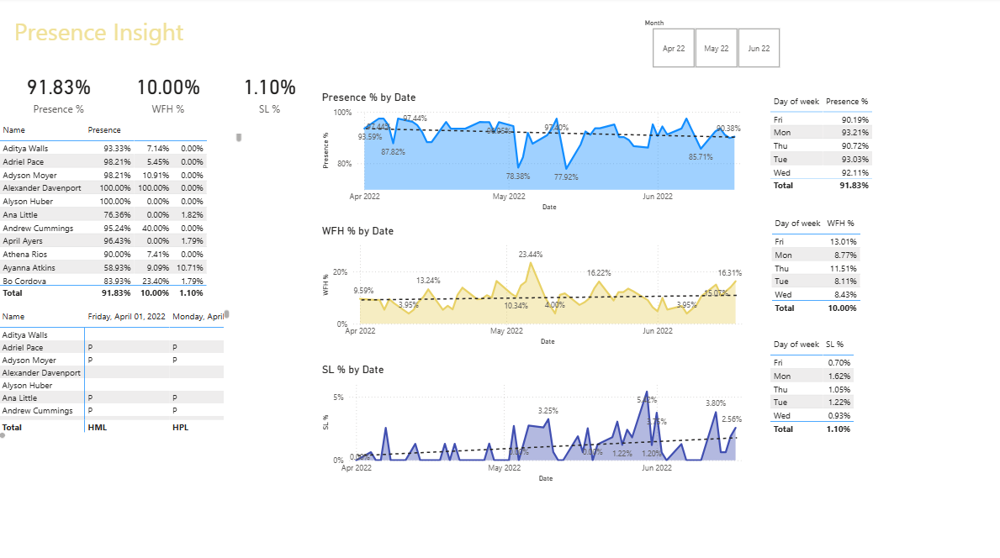
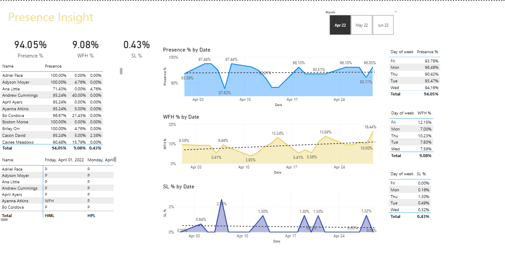
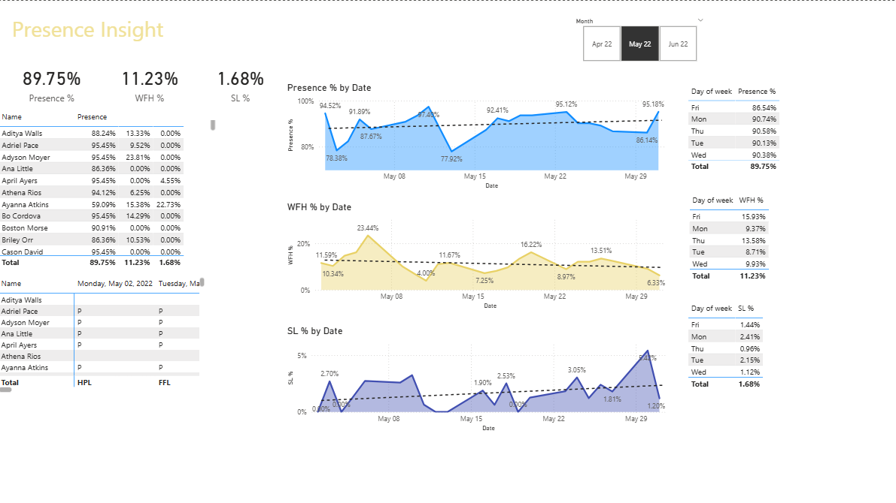

# HR-Analysis-using-Excel-and-Power-BI

## 📌 Project Overview

This project focuses on HR data analysis to gain insights into employee working preferences, attendance patterns, sick leave requests, and presence insights. Using Excel for data preparation and Power BI for visualization, the analysis helps HR teams make data-driven decisions to improve workforce management, employee engagement, and operational efficiency.
## 🎯 Objectives

- Analyze employee **working preference** (Work From Home vs. In-Office presence).

- Track **attendance records** for monitoring punctuality and absences.

- Review **sick leave requests** to identify trends and potential workforce issues.

- Provide **presence insights** for HR and management decision-making.
## 🛠 Tools & Technologies

- Excel – Data cleaning, preprocessing, and summary statistics.

- Power BI – Data visualization and dashboard creation.
## 📊 Key Insights

- Percentage of employees preferring **WFH vs. Presence.**

- Monthly and yearly **attendance trends.**

- **Sick leave patterns** to identify frequent requests.

- Interactive **presence insights dashboard** for HR decision-making.
## 📈 Dashboard Features

- **Working Preference Report** – WFH vs. Office presence.

- **Attendance Tracker** – Daily, monthly, and annual presence status.

- **Sick Leave Analysis** – Trends and impact on workforce availability.

- **Presence Insights** – Real-time overview of employee availability.
## 📂 Project Structure
``` bash HR-Analysis-using-Excel-and-Power-BI/
│── data/                # Raw and cleaned HR data (Excel)
│── excel-analysis/      # Data preprocessing & summary in Excel
│── powerbi-dashboard/   # Power BI reports & dashboards
│── README.md            # Project documentation
```
## 🚀 How to Use

- Open the **Excel files** for raw data and preprocessing steps.

- Import the cleaned dataset into **Power BI.**

- Explore the interactive **Power BI dashboard** for insights.
## 📌 Use Cases

- HR Managers – For workforce planning and attendance monitoring.

- Business Leaders – For productivity and policy decisions.

- Employees – For transparency in attendance and leave records.
## 📷 Sample Dashboard Preview
Analyze employee **working preference** (Work From Home vs. In-Office presence).Track **attendance records** for monitoring punctuality and absences.
<br />Review **sick leave requests** to identify trends and potential workforce issues.<br />
Provide **presence insights** for HR and management decision-making.
Percentage of employees preferring **WFH vs. Presence.**

- **Presence Percentage** : started trending down on Tuesday, January 11,2022,falling by 8.46%(8.19%) in 5 days.
- **Steep trend in Presence Percentage** : Presence % dropped from 96.79% to 88.61% during its steepest decline between Tuesday, January 11,2022 and Sunday, January 16,2022.
- **Long trend in Presence Percentage** : Presence % experienced the longest period of growth(+1.04%) between Sunday, January 2, 2022 and Saturday, January 8, 2022.

- **Recent trend in WFH Percentage** : WFH % started trending up on Friday, January 7, 2022, rising by 66.69%(4.38%) in 13 days.
- **Steep trend in WFH Percentage** : WFH% jumped from 6.57% to 10.96% during its steepest incline between Friday, January 7, 2022 and Thursday, January 20, 2022.
- **Long trend in WFH Percentage** : WFH % experienced the longest period of growth(+4.38%) between Friday, January 7, 2022 and Thursday, January 20, 2022.

- **Recent trend in SL Percentage** : SL % started trending up on Wednesday, January 26, 2022, rising by 331.02%(4.16%) in 4 days.
- **Steep trend in SL Percentage** : SL% jumped from 1.26% to 5.42% during its steepest incline between Wednesday, January 26, 2022 and Sunday, January 30, 202.
- **Long trend in SL Percentage** : SL % experienced the longest period of growth(+0.30%) between Tuesday, January 4, 2022 and Tuesday, January 25, 2022.

## 📬 Contact

For questions or collaboration:
<br />
👤 Bahre Hailemariam <br /> 
📧 bahre.hail@gmail.com

🌐 https://www.linkedin.com/in/bahre-hailemariam/
